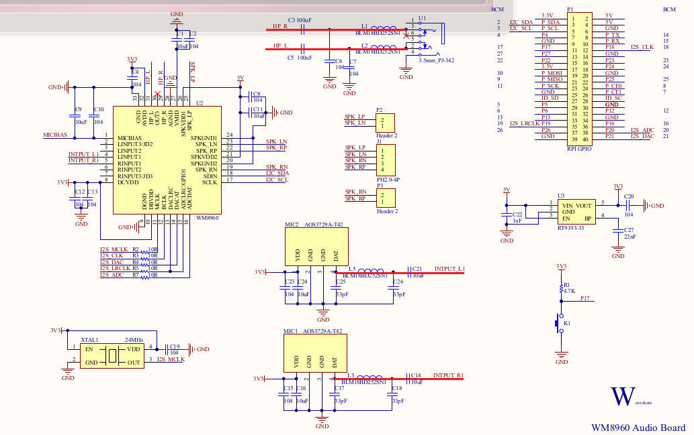
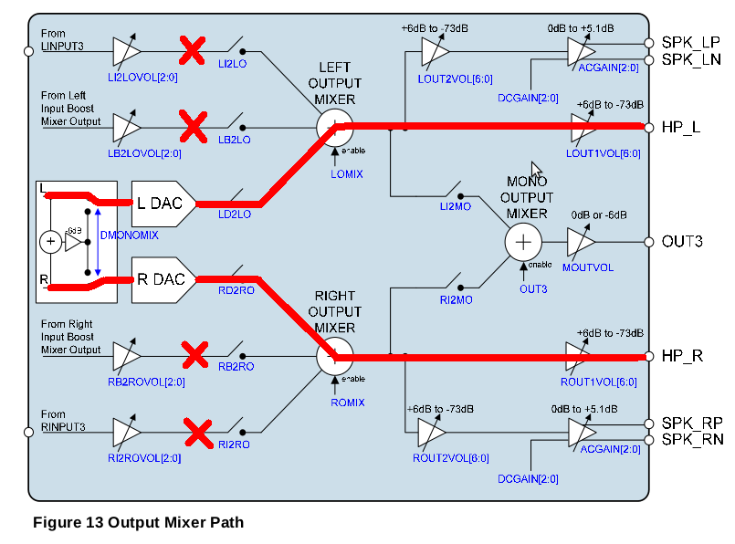
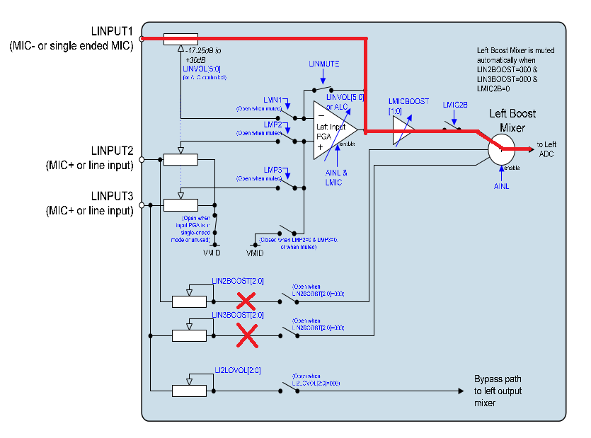

# waveshare rasp audio hat wm8960

WM8960-Audio-HAT

Test with:
flash sdcard with image 2017-11-29-raspbian-stretch.img
4.9.59-V7+
Respberry 3B

## audio

/boot/config

diable rasp audio, change 
	dtparam=audio=on
to 
	#dtpara=audio=on

add for uart consoe:
	enable_uart=1
	dtoverlay=pi3-disable-bt

WiFi connect to AP

copy WM8960-Audio-HAT-master/ to /home/pi
#the src copy from waveshare test image and is workable with 4.9.59-V7+.

sudo bash install.sh

reboot

aplay -l
arecord -l

sudo apt-get install mpg123

## mixer

## Button
==========button==========

dtc -I dts -O dtb -o breadboard.dtbo breadboard.dts
sudo cp breadboard.dts /boot/ovelay/
add to /boot/config.txt
	dtoverlay=breadboard

### test
Open a new terminal on rasp desktop and press button on audio hat.
The cursor add a new line in terminal as press enter key in keyboard.
